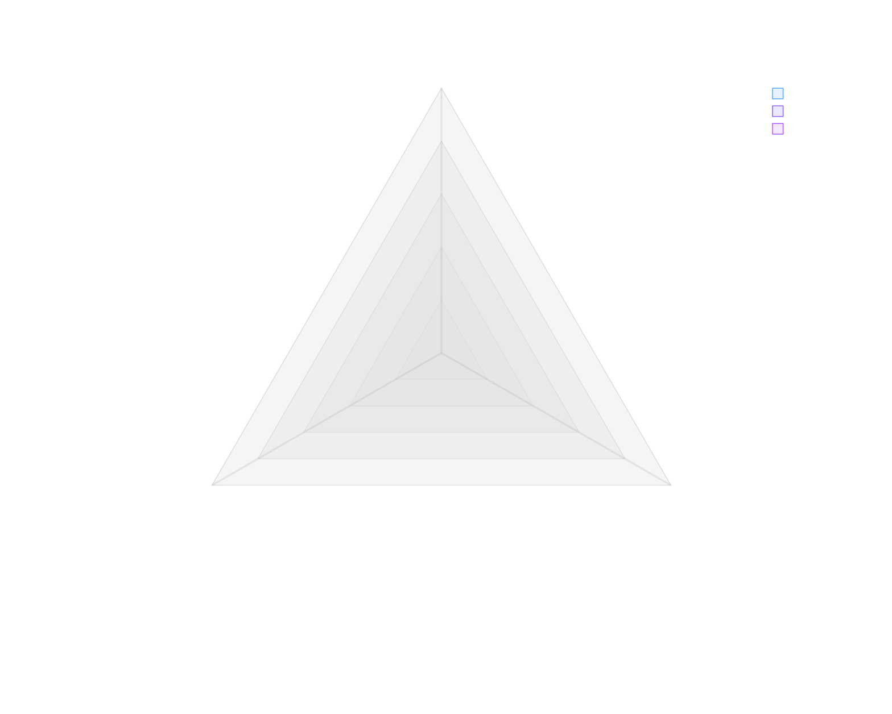

# {{date:YYYY}} Planning

## Key Focus Areas

- Home
- Lab
- Career
- Education
- Finance
- Health

## Target Focus Areas

## Key Initiatives

## Family Pillars

## Pillar Alignment

### Matrix View

### Pillar Distribution

## Prioritization

### Criteria

### Prioritization Matrix

