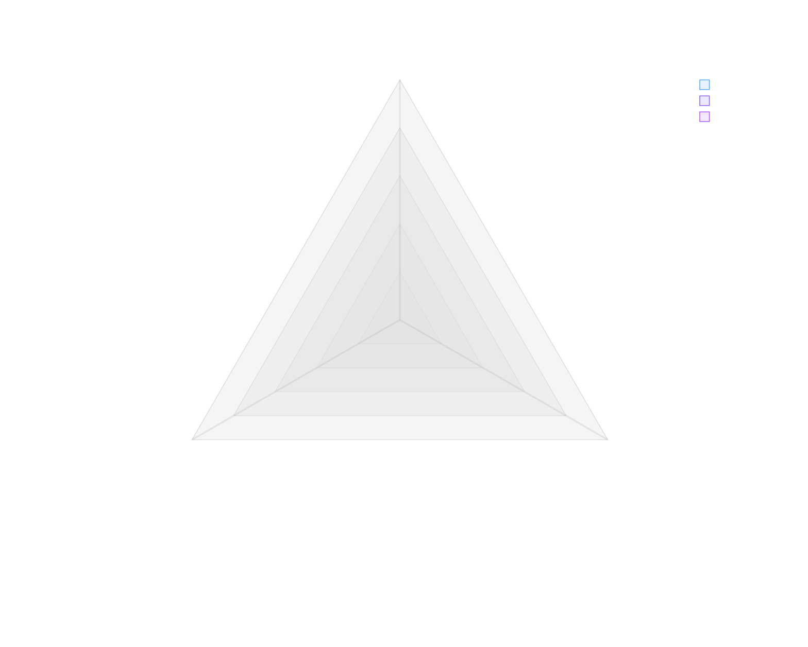

# {{date:YYYY}} Planning

## Key Stakeholders

## Capabilities

### Core Engineering Capabilities

### Target Capabilities

## Key Initiatives

### Initiative 1

### Initiative 2

### Initiative ...

## FY{{date:YYYY | add:1}} Pillars

## Pillar Alignment

### Matrix View

| Initiative | Pillar 1 | Pillar 2 | Pillar _n_ |
|------------|----------|----------|------------|
| Initiative 1 | ✓ |   |   |
| Initiative 2 |   | ✓ |   |
| Initiative _n_ |   |   | ✓ |

<!--
# Use for PDF generation

-->
  

<strong>Pillar Distribution</strong>

 

## Prioritization

### Criteria

### Prioritization Matrix

| Initiative | Criteria 1 | Criteria 2 | Criteria _n_ | Total Score |
|------------|------------|------------|--------------|-------------|
| Initiative 1 | 8 | 5 | 7 | 20 |
| Initiative 2 | 3 | 9 | 6 | 18 |
| Initiative _n_ | 6 | 4 | 8 | 18 |
